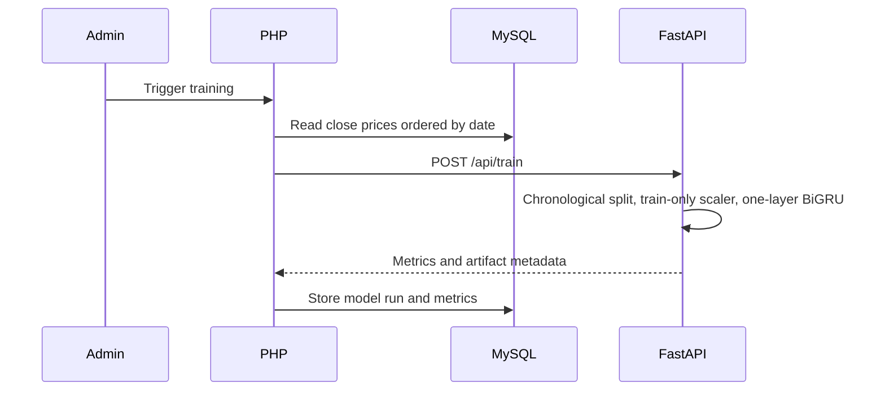

# Sequence Diagram

```mermaid
sequenceDiagram
    participant Admin
    participant PHP
    participant MySQL
    participant FastAPI
    Admin->>PHP: Trigger training
    PHP->>MySQL: Read close prices ordered by date
    PHP->>FastAPI: POST /api/train
    FastAPI->>FastAPI: Chronological split, train-only scaler, one-layer BiGRU
    FastAPI-->>PHP: Metrics and artifact metadata
    PHP->>MySQL: Store model run and metrics
```
