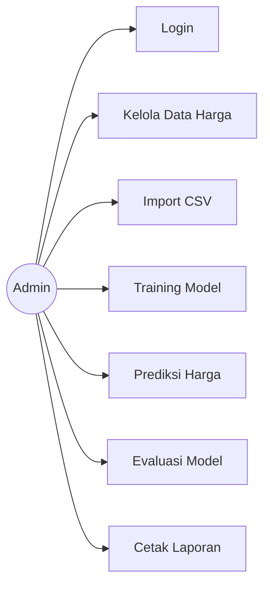

# Use Case Diagram

```mermaid
flowchart LR
    Admin((Admin))
    Admin --> Login[Login]
    Admin --> ManagePrices[Kelola Data Harga]
    Admin --> ImportCSV[Import CSV]
    Admin --> TrainModel[Training Model]
    Admin --> Predict[Prediksi Harga]
    Admin --> Evaluate[Evaluasi Model]
    Admin --> PrintReports[Cetak Laporan]
```
